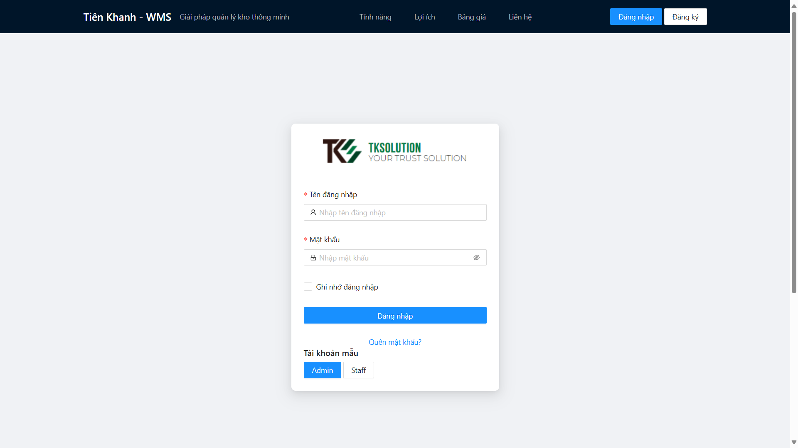
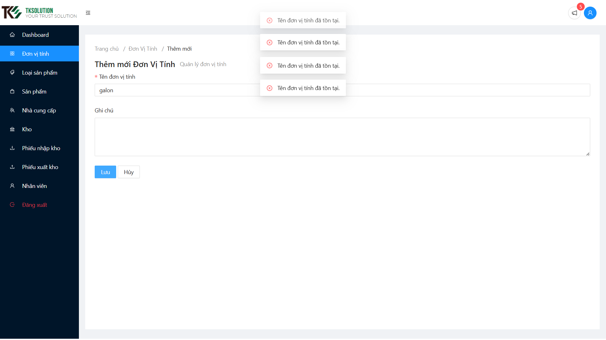
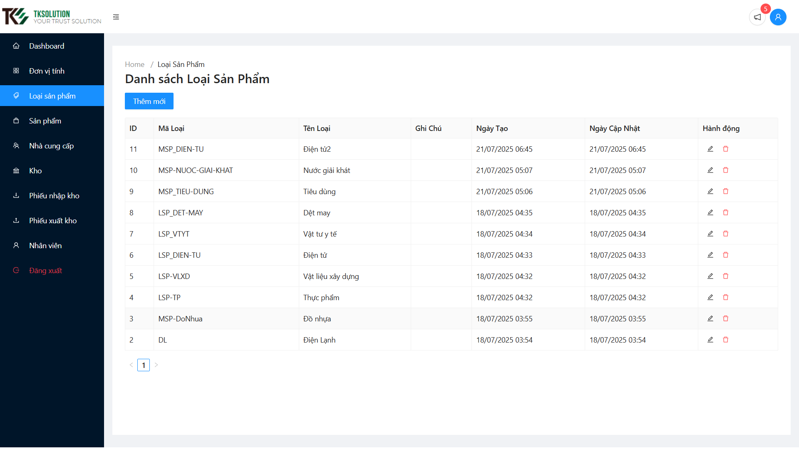
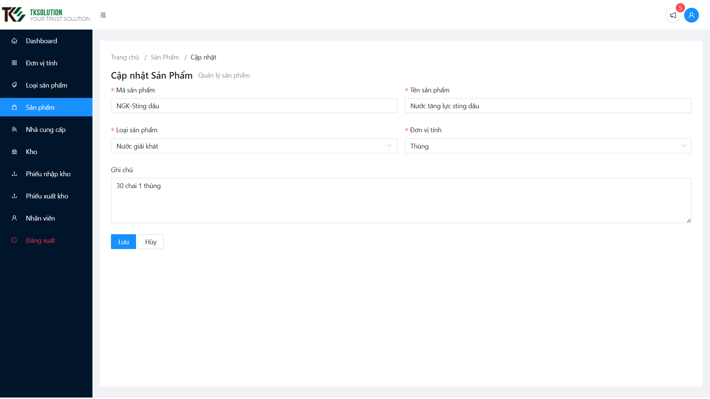
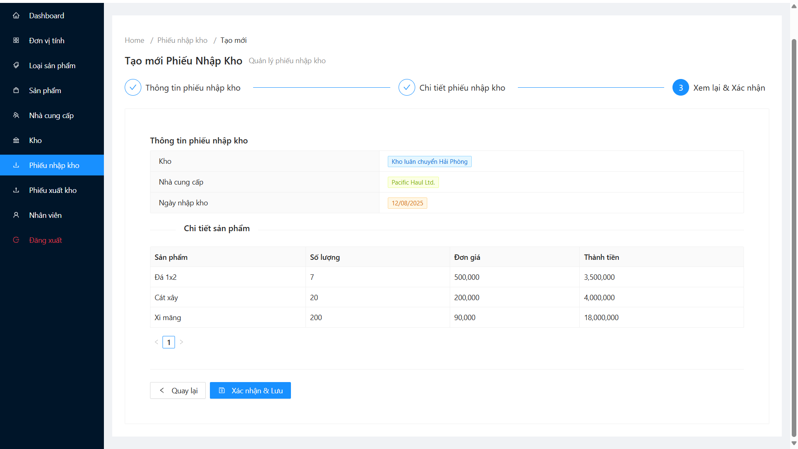
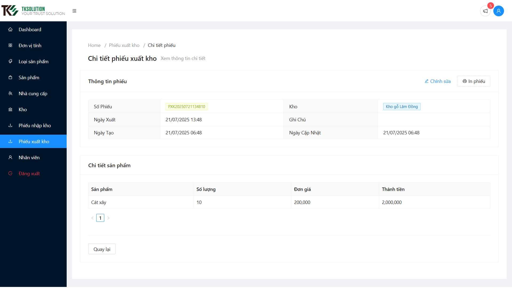
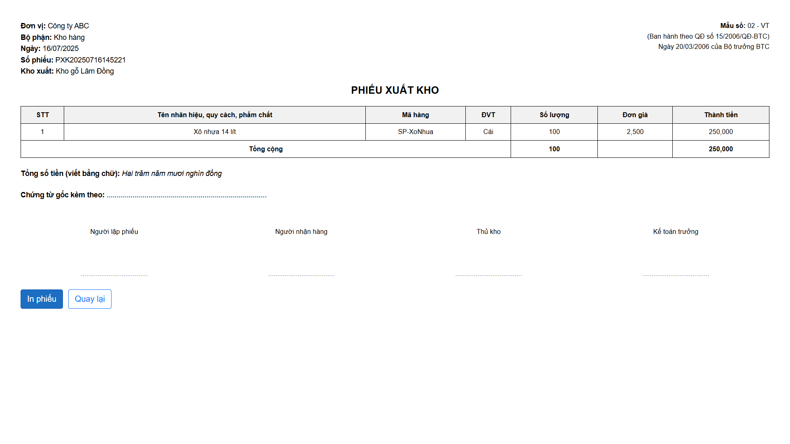

# Simple WMS web application using Blazor WebAssembly

> Chào các bạn, đây là dự án thực tập của mình tại Tiên Khanh Solutions, dự án này được xây dựng bằng blazorwebassembly, sử dụng các công nghệ mới nhất của .NET 8, bao gồm cả Blazor WebAssembly và ASP.NET Core.


## Giới thiệu

Dự án này là một ứng dụng web đơn giản sử dụng Blazor WebAssembly để quản lý các dịch vụ WMS (Warehouse Management System). Ứng dụng này cho phép người dùng quản lý kho hàng, theo dõi hàng tồn kho và thực hiện các thao tác liên quan đến quản lý kho.

## Tính năng chính

Các tính năng chính của ứng dụng bao gồm:
- Quản lý đơn vị tính (thêm, sửa, xóa)
- Quản lý loại sản phẩm (thêm, sửa, xóa)
- Quản lý sản phẩm (thêm, sửa, xóa)
- Quản lý nhà cung cấp (thêm, sửa, xóa)
- Quản lý kho hàng (thêm, sửa, xóa)
- Quản lý phiếu nhập kho (thêm, sửa, xóa)
- Thống kê hàng nhập.
- Quản lý phiếu xuất kho. (thêm, sửa, xóa)
- Thống kê hàng xuất.
- Thống kê tồn kho theo sản phẩm.
- Đăng nhập

## Thiết kế

### Database


### Usecase


## Previews

### Phần trang chủ

#### Hero section


#### Section tính năng nổi bật


#### Section lợi ích sử dụng


#### Section bảng giá


#### Section phản hồi của khách hàng


#### Section contact


### Trang đăng nhập



### Tính năng quản lý đơn vị tính

#### Danh mục đơn vị tính


#### Tạo đơn vị tính



### Loại sản phẩm

#### Danh mục loại sản phẩm



#### Tạo mới loại sản phẩm


### Sản phẩm

#### Danh mục sản phẩm


#### Cập nhật sản phẩm



#### Báo cáo xuất nhập tồn từng SP


### Nhà cung cấp

#### Danh sách nhà cung cấp


#### Cập nhật nhà cung cấp


### Kho

#### Danh mục kho


#### Chi tiết kho


#### Cập nhật thông tin kho


### Phiếu nhập kho

#### Danh sách phiếu nhập kho


#### Tạo phiếu nhập kho

##### Điền thông tin phiếu


##### Điền chi tiết phiếu


##### Review và xác nhận



#### Chi tiết phiếu nhập kho


#### In phiếu nhập kho 


#### Báo cáo chi tiết hàng nhập trong kỳ


### Phiếu xuất kho

#### Danh sách phiếu xuất kho


#### Cập nhật phiếu xuất kho

##### Chỉnh phần thông tin phiếu


##### Sửa chi tiết phiếu


##### Review trước khi xác nhận lưu


#### Chi tiết phiếu xuất kho




#### In phiếu xuất kho



#### Báo cáo chi tiết hàng xuất theo kỳ


## Hướng dẫn chạy code

Nào rảnh viết hehe

```sh
/\_/\ ♥
>^,^<
 / \
(___)_/
```
## Giấy phép

Dự án này được cấp phép theo [MIT License](LICENSE). Bạn có thể sử dụng, tham khảo và sửa đổi thoải mái.

